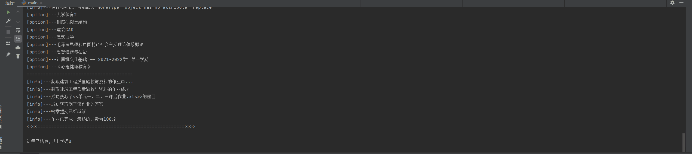

<div align="center">
    <h1 align="center">
     学习通,泛雅，超星 作业一键完成
    </h1>
<p>平时经常会遇到老师布置学习通上的作业，并且给发布的题和往届的基本一样，或者是已有人已经完成了作业并且做完后就会公布正确答案，只是顺序可能不一样，所以为了更加方便的学习，就有了这个脚本</p>
</div>


## 1️⃣实现方法
- 从已完成该课程的作业的账号中获取作业答案
- 登录到自己的账号获取题目顺序，与之前的答案进行比较获取到正确的选项或者填空
- 通过抓包工具对请求进行装包，分析表单请求，构造请求发起请求完成提交作业


## 2️⃣功能支持列表
> 该脚本目前已在其他的学校的学习通上成功运行，如果你在使用的时候遇到了问题，欢迎提交[issue](https://github.com/aglorice/new_xxt/issues)😍😍😍
* [x] 获取所有的课程
* [x] 获取课程作业
* [x] 提取已完成的作业的答案
* [x] 答案保存为json格式
* [x] 一键完成作业
* [x] 支持选择题，填空题，多选题，简答题，论述题，判断题等
* [x] 支持查看所有课程的未做作业
* [x] 支持根据未做作业在提供作业的账号上获取正确答案并保存到answer文件中
* [x] 新增批量完成同一个作业
## 3️⃣使用方法
#### 1.克隆到本地
```bash
git clone https://github.com/aglorice/new_xxt.git
```

#### 2.进入目录
```bash
cd new_xxt
```
#### 3.安装依赖
```bash
pip install -r requirements.txt

npm install
```
#### 4.运行`main.py`
```bash
python3 main.py
```
#### 注意：因为本脚本在账号登录的时候用到了`crypto-js`,需要nodejs，请提前配置。如果在运行的时候提示无效参数，直接再次运行一次就可以了。

## 4️⃣示例
`main.py`
```python
from xcxy_xxt import XcxyXxt,batchWork

# 已完成该作业的账号

phone = ""  
password = ""

# 未完成作业的账号和密码
# 当使用批量完成功能可以不用填写此处
_phone = ""
_password = ""

# 学校的学习通id
fid = 2397  # 选填(不填也没有影响)
refer = "http://scxcc.fanya.chaoxing.com/login/auth"  # 选填(不填也没有影响)

work_name = "第1章作业"
course_name = "操作系统原理"

if __name__ == '__main__':
    """查询所有未作的作业，并在已完成的答案中提取正确答案并保存在answer文件中"""
    # user_1 = XcxyXxt(phone=phone, password=password, fid=fid, refer=refer)
    # user_2 = XcxyXxt(phone=_phone, password=_password, fid=fid, refer=refer)
    # user_1.Login()
    # user_1.getCourseDate()
    # user_2.Login()
    # user_2.getCourseDate()
    # work_list = user_2.getAllNotDoneWork()  # 获取所有课程未作的作业
    # user_1.baseNotDoneWorkGetAnswer(work_list)  # 根据未做的作业来寻找正确的答案

    """查询指定的作业并完成它"""
    print("<<<<======================================================>>>>")
    user_1 = XcxyXxt(phone=phone, password=password, fid=fid, refer=refer)
    user_1.Login()
    user_1.getCourseDate()
    user_1.getCourseWork(course_name)
    answer = user_1.getWorkAnswer(work_name)
    user_1.dateToJsonFile("answer.json", answer)
    print("<<<<======================================================>>>>\n\n\n")
    print("<<<<======================================================>>>>")
    user_2 = XcxyXxt(phone=_phone, password=_password, fid=fid, refer=refer)
    user_2.Login()
    user_2.getCourseDate()
    user_2.getCourseWork(course_name)
    user_2.getWorkView(work_name, "answer.json")
    user_2.completedWork(work_name=work_name)
    print("<<<<======================================================>>>>")

    """批量完成作业"""
    print("<<<<======================================================>>>>")

    batchWork(work_name=work_name, course_name=course_name, fid=fid, refer=refer, file='user.json')

    print("<<<<======================================================>>>>")
```
`answer.json`
```json
{
  "1.json": [
    {
      "id": "163497980",
      "title": "1.(单选题)在数据结构中，与所使用的计算机无关的是数据的（）结构。",
      "type": "单选题",
      "answer": "A",
      "option": [
        "A. 逻辑",
        "B. 存储",
        "C. 逻辑和存储",
        "D. 物理"
      ]
    },
    {
      "id": "163498096",
      "title": "2.(单选题)算法分析的两个主要方面是（）。",
      "type": "单选题",
      "answer": "A",
      "option": [
        "A. 空间复杂度和时间复杂度",
        "B. 正确性和简明性",
        "C. 可读性和文档性",
        "D. 数据复杂性和程序复杂性"
      ]
    },
    ...
  ]
}
```

使用批量完成作业时请配置该文件`user.json`
```json
{
  "user": [
    {
      "phone": "手机号",
      "password": "密码"
    },
    {
      "phone": "123123",
      "password":  "234235423"
    }
    ...
  ]
}
```
终端运行结果:

## 5️⃣注意事项
- 仓库发布的`new_xxt`项目中涉及的任何脚本，仅用于测试和学习研究，禁止用于商业用途，不能保证其合法性，准确性，完整性和有效性，请根据情况自行判断。
- 本项目遵循GPL-3.0 License协议，如果本特别声明与GPL-3.0 License协议有冲突之处，以本特别声明为准。
- 以任何方式查看此项目的人或直接或间接使用`new_xxt`项目的任何脚本的使用者都应仔细阅读此声明。`aglorice` 保留随时更改或补充此免责声明的权利。一旦使用并复制了任何相关脚本或`new_xxt`项目，则视为您已接受此免责声明。

**最后注意一下，作业还是得自己做，这种行为是不对得😁😁😁**

