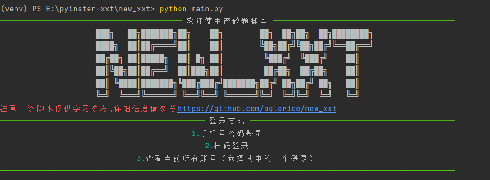
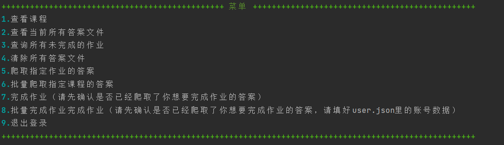
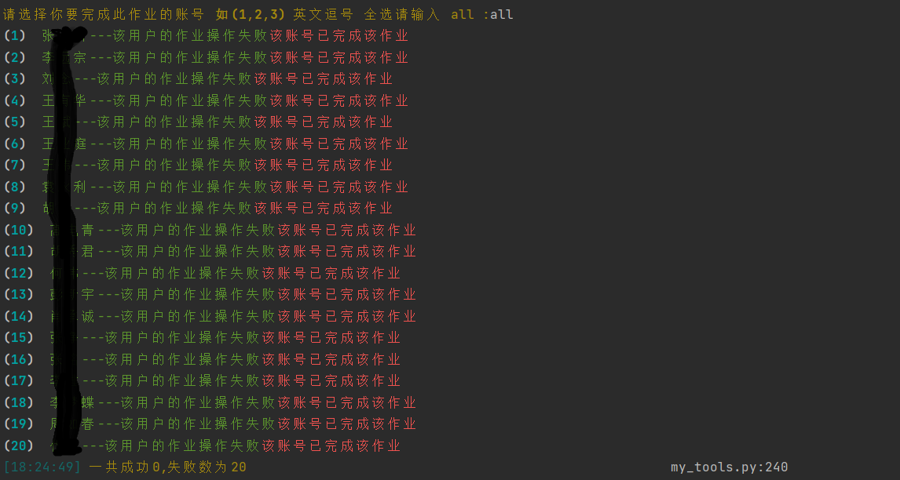

<div align="center">
    <h1 align="center">
     学习通,泛雅，超星 作业一键完成（全新版本✨✨✨）
    </h1>
    
<p>该脚本仅用于爬虫技术的学习，如果你有好的功能或者想法，欢迎提交pr<a href=""></a></p>
</div>


## 1️⃣实现方法
- 从已完成该课程的作业的账号中获取作业答案
- 登录到自己的账号获取题目顺序，与之前的答案进行比较获取到正确的选项或者填空
- 构造表单数据发起请求完成提交作业


## 2️⃣功能支持列表
> 该脚本目前已在其他的学校的学习通上成功运行，如果你在使用的时候遇到了问题，欢迎提交[issue](https://github.com/aglorice/new_xxt/issues)😍😍😍
### 🚀已实现的功能
* [x] 查询所有的课程
* [x] 查询课程作业
* [x] 提取已完成的作业的答案
* [x] 答案保存为json格式
* [x] 一键完成作业
* [x] 支持选择题，填空题，多选题，简答题，论述题，判断题等
* [x] 查询所有课程的未做作业
* [x] 查看作业的成绩以及完成状态
* [x] 获取个人信息
* [x] 查看作业是否可以重做
* [x] 手机号密码登录
* [x] 实现扫码登录
* [x] 在没有正确答案的情况下提取自己的答案(测试)
* [x] 多用户批量完成作业
* [x] 批量提取一个课程所有的作业
* [x] 自动识别匹配答案策略
* [x] 新增自动进行重做操作😁
### todo✨✨✨
* [ ] 对接题库
* [ ] ai自动识别答案(chatgpt3.5)
* [ ] 提取待批阅作业的答案
## 目前对题型支持

| 题型  | 完成状态     |
|-----|----------|
| 单选题 | ✅支持      |
| 多选题 | ✅支持      |
| 判断题 | ✅支持      |
| 简答题 | ✅支持（未测试） |
| 填空题 | ✅支持      |
| 论述题 | ✅支持（未测试） |
| 其他  | ✅支持（未测试） |
| 编程题 | ✅支持      |

## 3️⃣使用方法
#### 1.克隆到本地
```bash
git clone https://github.com/aglorice/new_xxt.git
```

#### 2.进入目录
```bash
cd new_xxt
```
#### 3.安装依赖
```bash
pip install -r requirements.txt
```
#### 4.运行`main.py`
```bash
python main.py
```
#### 5.使用爬取功能去爬取已完成的作业的账号，得到答案文件后，你可以选择将得到的json文件移动到`answers`文件下，然后使用完成作业的功能即可。使用批量功能前，请提前配置 `user.json`
#### 如果觉得上述方式比较麻烦，该项目提供exe版本，打开 [releases](https://github.com/aglorice/new_xxt/releases),找到 `xxt.zip`,下载下来，解压后运行 `xxt/xxt.exe` 即可。

### 🐞🐞🐞如果提交的时候显示无效的参数请重新运行一次就可以了。
`answers/27835863.json`
```json
{
  "27835863": [
    {
      "id": "163497980",
      "title": "1.(单选题)在数据结构中，与所使用的计算机无关的是数据的（）结构。",
      "type": "单选题",
      "answer": "A",
      "option": [
        "A. 逻辑",
        "B. 存储",
        "C. 逻辑和存储",
        "D. 物理"
      ]
    },
    {
      "id": "163498096",
      "title": "2.(单选题)算法分析的两个主要方面是（）。",
      "type": "单选题",
      "answer": "A",
      "option": [
        "A. 空间复杂度和时间复杂度",
        "B. 正确性和简明性",
        "C. 可读性和文档性",
        "D. 数据复杂性和程序复杂性"
      ]
    },
    ...
  ]
}
```
`user.json`
```json
{
  "users": [
    {
      "phone":"你的手机号",
      "password": "密码",
      "name": "test1"
    },
    {
      "phone":"你的手机号",
      "password": "密码",
      "name": "test1"
    }
  ]
}
```

### 终端运行结果（可能会和新版存在差异，以最新版本为主）:

#### 选择功能

#### 批量完成作业


## 4️⃣注意事项
- 仓库发布的`new_xxt`项目中涉及的任何脚本，仅用于测试和学习研究，禁止用于商业用途，不能保证其合法性，准确性，完整性和有效性，请根据情况自行判断。
- 本项目遵循GPL-3.0 License协议，如果本特别声明与GPL-3.0 License协议有冲突之处，以本特别声明为准。
- 以任何方式查看此项目的人或直接或间接使用`new_xxt`项目的任何脚本的使用者都应仔细阅读此声明。`aglorice` 保留随时更改或补充此免责声明的权利。一旦使用并复制了任何相关脚本或`new_xxt`项目，则视为您已接受此免责声明。


### 如果你觉得不错的话，就请我吃颗糖吧。😁😁😁


### Star History

[](https://star-history.com/#aglorice/new_xxt&Date)
